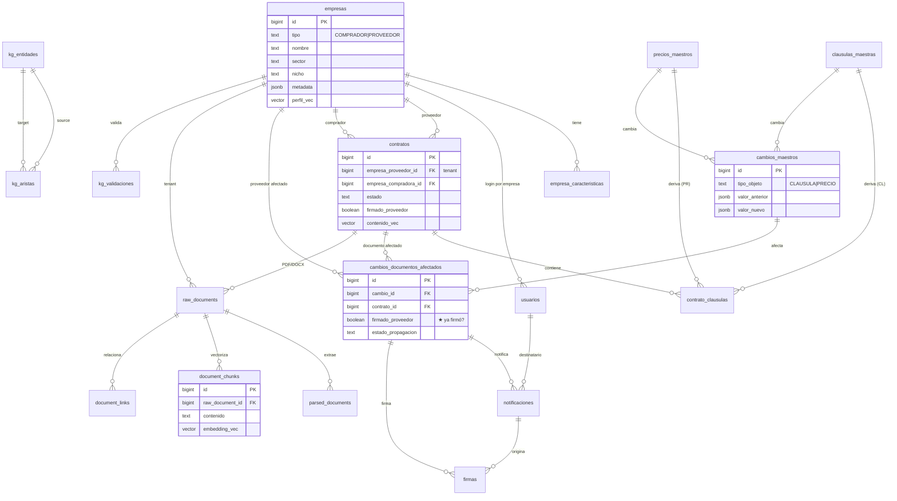
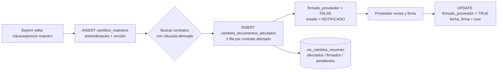
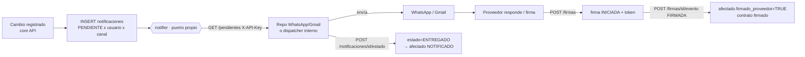

# Diagrama ER — gestión documental B2B (vista inline)

> Render automático en GitHub/VSCode (Mermaid). Para la versión completa con todos
> los atributos usar [schema.dbml](schema.dbml) en dbdiagram.io.

## Flujo de la feature central (cambio → afectados → firma)

## Notificación + firma electrónica (microservicio notifier)

